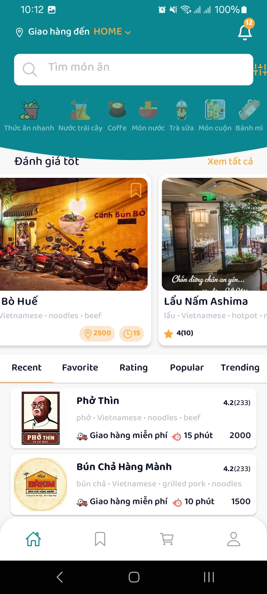
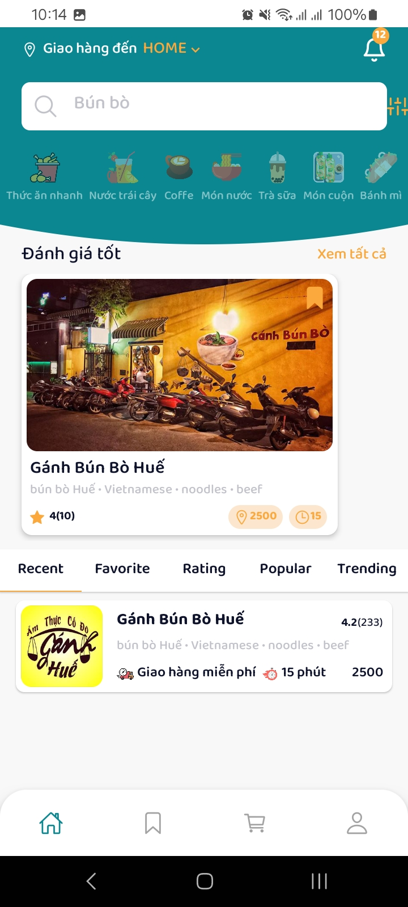
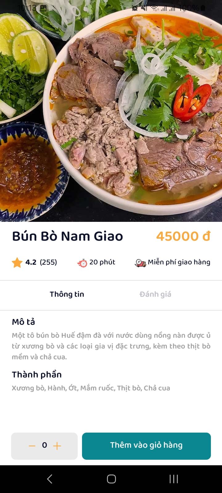
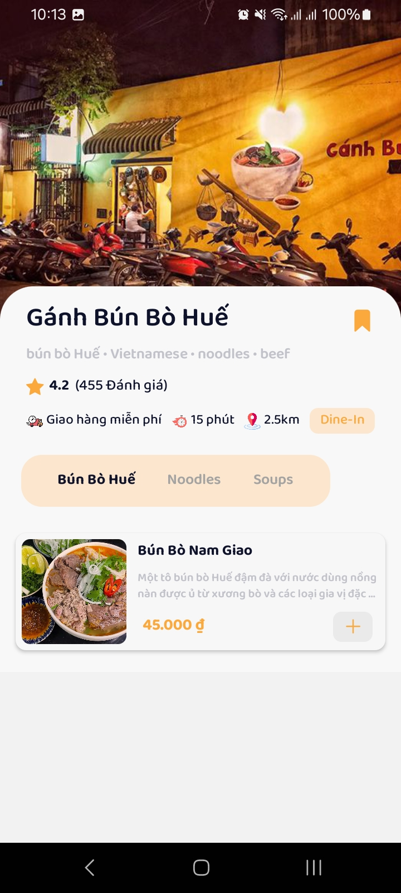
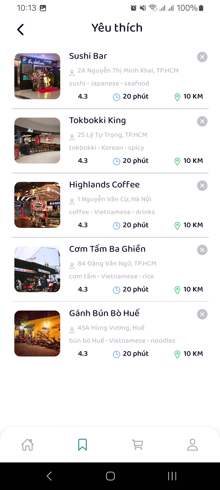
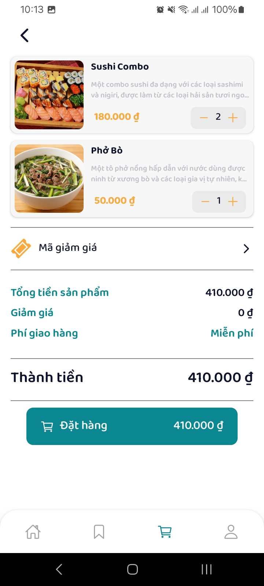

# 🍔 Foody - Food Delivery Mobile App

[](https://reactnative.dev/)
[](https://www.typescriptlang.org/)
[](https://redux.js.org/)
[](https://reactnavigation.org/)

A modern food delivery application built with React Native, designed to provide users with a seamless food ordering experience. Foody brings your favorite restaurants and dishes right to your fingertips.


## 🚀 Features

- **User Authentication**
  - Secure login and registration system
  - Social media integration
  - Profile management

- **Food Discovery**
  - Browse restaurants and food items
  - Search functionality with filters
  - Detailed food information and reviews

- **Order Management**
  - Add items to cart
  - Customize orders
  - Track order status
  - Order history

- **Favorites & Recommendations**
  - Save favorite restaurants and dishes
  - Personalized recommendations
  - Recent orders

## 📱 Screenshots

| Login | Register | Home |
|-------|----------|------|
|  |  |  |

| Search | Food Detail | Shop |
|--------|-------------|------|
|  |  |  |

| Favorites | Checkout |
|-----------|----------|
|  |  |

## 🛠️ Technical Stack

- **Frontend**
  - React Native
  - TypeScript
  - Redux for state management
  - React Navigation
  - Axios for API calls

- **Styling**
  - React Native Paper
  - Custom components
  - Responsive design

- **Development Tools**
  - ESLint
  - Prettier
  - Jest for testing

## 🎯 Project Goals

This project was developed with the following objectives:
- Create a user-friendly food delivery experience
- Implement modern mobile app development practices
- Showcase clean code architecture
- Demonstrate problem-solving skills
- Learn and apply best practices in React Native development

## 💻 Installation

1. Clone the repository
```bash
git clone https://github.com/leductinjl/foody_app.git
```

2. Install dependencies
```bash
npm install
# or
yarn install
```

3. Start the development server
```bash
npm start
# or
yarn start
```

4. Run on iOS/Android
```bash
npm run ios
# or
npm run android
```

## 📚 Learning Outcomes

Through this project, I have gained:
- Hands-on experience with React Native development
- Understanding of mobile app architecture
- State management with Redux
- API integration and data handling
- UI/UX design principles
- Problem-solving and debugging skills
- Version control with Git
- Team collaboration practices

## 🔍 Future Improvements

- Implement real-time order tracking
- Add payment gateway integration
- Enhance user profile features
- Optimize app performance
- Add more customization options
- Implement push notifications

## 🤝 Contributing

Contributions are welcome! Please feel free to submit a Pull Request.

## 📄 License

This project is licensed under the MIT License - see the LICENSE file for details.

## 📞 Contact

For any inquiries or feedback, please reach out to:
- Email: [leductin.ld@gmail.com](mailto:leductin.ld@gmail.com)
- GitHub: [leductinjl](https://github.com/leductinjl) 